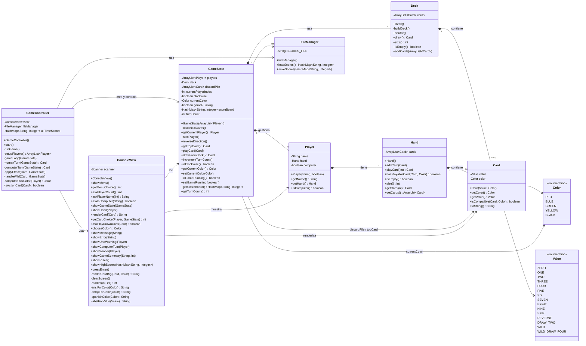

```mermaid
classDiagram
direction LR

%% ========================
%% MODEL
%% ========================

class Card {
  -Value value
  -Color color
  +Card(Value, Color)
  +getColor() Color
  +getValue() Value
  +isCompatible(Card, Color) boolean
  +toString() String
}

class Color {
  <<enumeration>>
  RED
  BLUE
  GREEN
  YELLOW
  BLACK
}

class Value {
  <<enumeration>>
  ZERO
  ONE
  TWO
  THREE
  FOUR
  FIVE
  SIX
  SEVEN
  EIGHT
  NINE
  SKIP
  REVERSE
  DRAW_TWO
  WILD
  WILD_DRAW_FOUR
}

class Deck {
  -ArrayList~Card~ cards
  +Deck()
  -buildDeck()
  +shuffle()
  +draw() Card
  +size() int
  +isEmpty() boolean
  +addCards(ArrayList~Card~)
}

class Hand {
  -ArrayList~Card~ cards
  +Hand()
  +addCard(Card)
  +playCard(int) Card
  +hasPlayableCard(Card, Color) boolean
  +isEmpty() boolean
  +size() int
  +getCard(int) Card
  +getCards() ArrayList~Card~
}

class Player {
  -String name
  -Hand hand
  -boolean computer
  +Player(String, boolean)
  +getName() String
  +getHand() Hand
  +isComputer() boolean
}

class GameState {
  -ArrayList~Player~ players
  -Deck deck
  -ArrayList~Card~ discardPile
  -int currentPlayerIndex
  -boolean clockwise
  -Color currentColor
  -boolean gameRunning
  -HashMap~String, Integer~ scoreBoard
  -int turnCount
  +GameState(ArrayList~Player~)
  +dealInitialCards()
  +getCurrentPlayer() Player
  +nextPlayer()
  +reverseDirection()
  +getTopCard() Card
  +playCard(Card)
  +drawFromDeck() Card
  +incrementTurnCount()
  +isClockwise() boolean
  +getCurrentColor() Color
  +setCurrentColor(Color)
  +isGameRunning() boolean
  +setGameRunning(boolean)
  +getScoreBoard() HashMap~String, Integer~
  +getTurnCount() int
}

%% ========================
%% VIEW
%% ========================

class ConsoleView {
  -Scanner scanner
  +ConsoleView()
  +showMenu()
  +getMenuChoice() int
  +askPlayerCount() int
  +askPlayerName(int) String
  +askIsComputer(String) boolean
  +showGameState(GameState)
  +showHand(Player)
  +renderCard(Card) String
  +getCardChoice(Player, GameState) int
  +askPlayDrawnCard(Card) boolean
  +chooseColor() Color
  +showMessage(String)
  +showError(String)
  +showUnoWarning(Player)
  +showComputerTurn(Player)
  +showWinner(Player)
  +showGameSummary(String, int)
  +showRules()
  +showHighScores(HashMap~String, Integer~)
  +pressEnter()
  -renderCardBig(Card, Color) String
  -clearScreen()
  -readInt(int, int) int
  -ansiForColor(Color) String
  -emojiForColor(Color) String
  -spanishColor(Color) String
  -labelForValue(Value) String
}

%% ========================
%% CONTROLLER
%% ========================

class GameController {
  -ConsoleView view
  -FileManager fileManager
  -HashMap~String, Integer~ allTimeScores
  +GameController()
  +start()
  -runGame()
  -setupPlayers() ArrayList~Player~
  -gameLoop(GameState)
  -humanTurn(GameState) Card
  -computerTurn(GameState) Card
  -applyEffect(Card, GameState)
  -handleWild(Card, GameState)
  -computerPickColor(Player) Color
  -isActionCard(Card) boolean
}

%% ========================
%% UTILS
%% ========================

class FileManager {
  -String SCORES_FILE
  +FileManager()
  +loadScores() HashMap~String, Integer~
  +saveScores(HashMap~String, Integer~)
}

%% ========================
%% RELACIONES - MODEL
%% ========================
Card --> Color
Card --> Value

Deck "1" *-- "many" Card : contiene
Hand "1" *-- "many" Card : contiene
Player "1" *-- "1" Hand : tiene
GameState "1" *-- "many" Player : gestiona
GameState "1" *-- "1" Deck : usa
GameState --> Card : discardPile / topCard
GameState --> Color : currentColor
GameState --> "scoreBoard" FileManager

%% ========================
%% RELACIONES - MVC
%% ========================
GameController --> ConsoleView : usa
GameController --> FileManager : usa
GameController --> GameState : crea y controla
ConsoleView --> GameState : lee
ConsoleView --> Player : muestra
ConsoleView --> Card : renderiza
```
